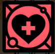

- 
- Attuned: Health
  This skill is attuned to my Health. [When you committed this Skill to the Tree, you gained Health. Find somewhere with a matching Evolve aspect, and you can use the Skill - once only - to combine two Health cards into a stronger card.]