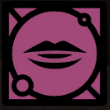

- 
- Attuned: Shapt
  This skill is attuned to my Shapt. [When you committed this Skill to the Tree, you gained Shapt. Find somewhere with a matching Evolve aspect, and you can use the Skill - once only - to combine two Shapt cards into a stronger card.]