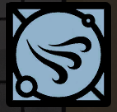

- 
- Attuned: Trist
  This skill is attuned to my Trist. [When you committed this Skill to the Tree, you gained Trist. Find somewhere with a matching Evolve aspect, and you can use the Skill - once only - to combine two Trist cards into a stronger card.]