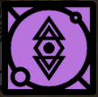

- 
- Attuned: Wist
  This skill is attuned to my Wist. [When you committed this Skill to the Tree, you gained Wist. Find somewhere with a matching Evolve aspect, and you can use the Skill - once only - to combine two Wist cards into a stronger card.]