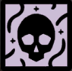

- 
- Chionic Theoplasma
- This book suffered the attention of one of the chilly Names or Hours, perhaps even a god-from-Nowhere. [This contamination can affect your Trist and Health, and spread to nearby objects. You can remove it with a skill that's effective against Theoplasmic Contamination, and at least 7 Heart.]