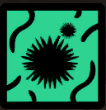

- 
- Keeperskin
- This book is blotched with keeperskin, a luminous fungus that grows in the Wood we see in sleep, and enters the world when a dreamer inhales its spores. [Keeperskin contamination can affect your Ereb and Chor, and spread to nearby objects. You can remove it with a skill that's effective against Corruptions, if you provide at least 7 Nectar.]