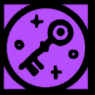

filters:: {"memory" true}

- 
- Knock
- The principle called Knock permits no seal and no isolation. It thrusts us gleefully out of the safety of ignorance. [Knock opens doors and unseams barriers.]