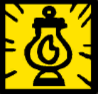

filters:: {"memory" true}

- 
- Lantern
  'Life is a pure flame, and we live by an invisible Sun within us.' - Thomas Browne. [Lantern is the principle of the secret place sometimes called the House of the Sun, and of the light above it.]