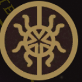

- 
- Memories: the Archaeologist
  'I opened a tomb, and found - too late - that it was a prison. The plague that I released is now my shadow - or perhaps I am its reflection. It is too late to set matters right, but it is never too late to protect the future from the past. In Hush House I can do no harm. Perhaps I can even make amends.'