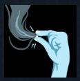

- 
- Quenchings & Quellings
  Arts which quench fires and bring solace to the troubled mind. 'A true adept is never troubled by fire, nor by fever, nor by restless spirit.' - Ambrose Westcott
- [[Heart]], [[Winter]], [[Skill]], [[Hushery]], [[Committed]], [[Attuned: Trist]], [[Effective Against Theoplasmic Contamination]]