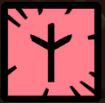

- 
- Written in Phrygian
- The Phrygians worshipped the Great Mother, who we call the Grail. Theirs was the land in which the Sisterhood of the Knot was born, and this is the tongue in which the Thunderskin pleaded, at his ascension. [The Librarian can read Phrygian, but few others can.]